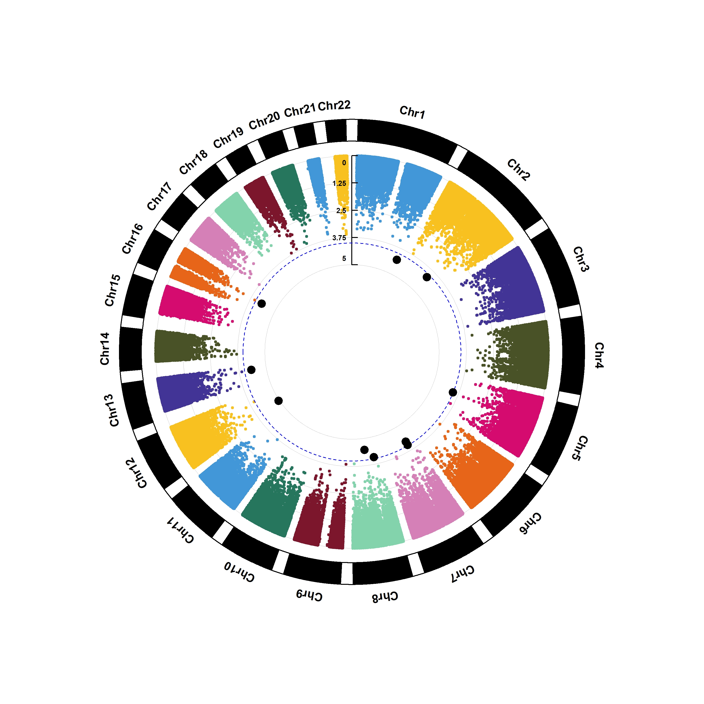

# Childhood Acute lymphoblastic leukemia age-specific association 

```{r message=FALSE, warning=FALSE, echo=FALSE}
library(readxl)
library(ggplot2)
library(data.table)
library(dplyr)
library(plotly)
library(purrr) # to append multiple dataframes
library(CMplot)
library(qqman)
```
## Introduction
```{r message=FALSE, warning=FALSE, echo=FALSE}
Age_incidence <- read_excel("C:/SANDEEP/MAIN/CAREER/My_papers/PAPERS_in_PROGRESS/AGE_ALL/Age_incidence_rate.xlsx")
```

```{r, echo=FALSE, fig.align="center", fig.cap= "Figure 1: Age-specific incidence rate in childhood ALL"}
ggplot(Age_incidence, aes(x = Age, y = Incidence_rate))+
  geom_line(linetype = "dashed", color="blue")+
  geom_point()+
  xlab("Age (year)")+
  ylab("Incidence Rate/1,000,000")+
  scale_x_continuous(breaks=0:14,
                     labels=c("<1", "1", "2", "3", "4", "5", "6", "7", "8", "9", "10", "11", "12", "13", "14"))+
  scale_y_continuous(breaks=c(0,10, 20, 30, 40, 50, 60, 70, 80, 90, 100))+
  theme_classic()
```

## Method

* Results were obtained using PLINK 
```{r echo=FALSE, warning=FALSE, message=FALSE}
# Formatted table
Age_result <- read_excel("C:/SANDEEP/MAIN/CAREER/My_papers/PAPERS_in_PROGRESS/AGE_ALL/ALL_AGE_DATA_NEW/AGE_ASS_formatted.xlsx") %>%
  filter(TEST == "ADD", CHR < 23) %>%
  select(SNP, CHR, BP, P)


knitr::kable(Age_result[1:5, ], align = "lccrr", caption = "Table 1: Final Result.")
```

```{r echo=FALSE, fig.align="center", out.width= "40%", fig.cap= "Figure 3: QQ plot"}
qq(Age_result$P)
```

```{r, include=FALSE, echo=FALSE, fig.align="center", fig.width=4, fig.height=4, fig.cap= "Figure 4: Circular Manhattan plot"}
CMplot(Age_result, type="p", plot.type="c", r=1.2, cir.legend=TRUE,
       chr.labels=paste("Chr",c(1:22),sep=""), threshold=c(1e-5,1e-4),
       cir.chr.h=1.5,threshold.lty=c(1,2),threshold.col=c("red",
       "blue"),signal.col=c("red","black"), file="jpg", memo="",dpi=300,file.output=TRUE, verbose=FALSE,width=10,height=10)
```

```{r fig.align="center", out.width= "60%", fig.cap= "Figure 4: Circular Manhattan plot"}

```

```{r echo=FALSE}
Age_P <- read_excel("C:/SANDEEP/MAIN/CAREER/My_papers/PAPERS_in_PROGRESS/AGE_ALL/ALL_AGE_DATA_NEW/AGE_Pvalue.xlsx")


knitr::kable(Age_P[1:5, ], align = "lccrr", caption = "Top one hundred SNPs associated with childhood ALL risk with age-specificity.")
```

* Creating a text file to keep 100 SNPs

```{r}
Age_P_100 <- Age_P %>% 
  select(SNP)

# write.table(Age_P_100, file="Top_100_P_value.txt",
#             sep = "/t",
#             quote = FALSE,
#             col.names = FALSE,
#             row.names = FALSE)
```


* Hence we had a total of 100 SNPs
* Next we downloaded SNPs in LD with GWAS SNPs using LDlink
* Downloaded files were merged and cleaned using r2 >=0.8
* Duplicated SNPs were removed from further analysis
* Final file containing all SNPs are AGE_ALL_LDlink.txt

```{r echo=FALSE}
AGE_SNP_LD <- fread("C:/SANDEEP/MAIN/CAREER/My_papers/PAPERS_in_PROGRESS/AGE_ALL/AGE_ALL_LDlink.txt") %>%
  rename(Main_SNP = "SNP") %>%
  select(Main_SNP, LD_SNP)

knitr::kable(AGE_SNP_LD[1:5, ], align = "lccrr", caption = "Age-specific SNPs and SNPs in LD.")
```

* A total of 3099 SNPs were obtained from LDlink 

* SNP (rs202050948) identifed in AGE association was not available in LDlink, hence SNPs located in LD for this SNP was obtained from Haploreg. This SNP is not in LD with any other SNP


### File creation for SNPnexus using LDSNP information 
```{r echo=FALSE}
AGE_SNP_LD$dbSNP <- "dbSNP"  #Creating a new column with dbSNP name and all columns are filled with dbSNP as required for SNPnexus
Age_SNPnexus <- AGE_SNP_LD %>%
  select(dbSNP, LD_SNP)

head(Age_SNPnexus, 2)
```

```{r echo=FALSE}
# creating a text file for SNPnexus analysis
# write.table(Age_SNPnexus, file = "C:/SANDEEP/MAIN/CAREER/My_papers/PAPERS_in_PROGRESS/AGE_ALL/ALL_AGE_DATA_NEW/AGE_SNPnexus.txt",
#             row.names = FALSE,
#             col.names = FALSE,
#             sep = "\t",
#             quote = FALSE)
```

### File preparation for  ANNOVAR using LD_SNP information
* Creating only SNP column to 
```{r echo=FALSE}
Age_Annovar_1 <- AGE_SNP_LD %>%
  select(LD_SNP)

head(Age_Annovar_1, 2)
```

```{r echo=FALSE}
# creating a text file for ANNOVAR analysis
# write.table(Age_SNPnexus, file = "C:/SANDEEP/MAIN/CAREER/My_papers/PAPERS_in_PROGRESS/AGE_ALL/ALL_AGE_DATA_NEW/AGE_ANNOVAR_pre.txt",
#             row.names = FALSE,
#             col.names = FALSE,
#             sep = "\t",
#             quote = FALSE)
```
