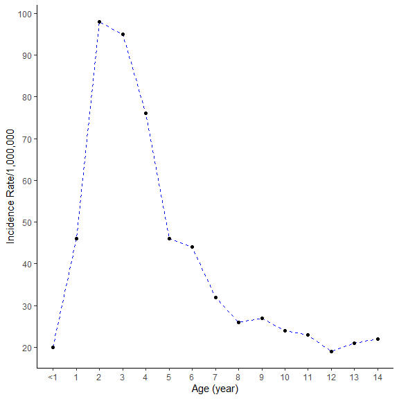
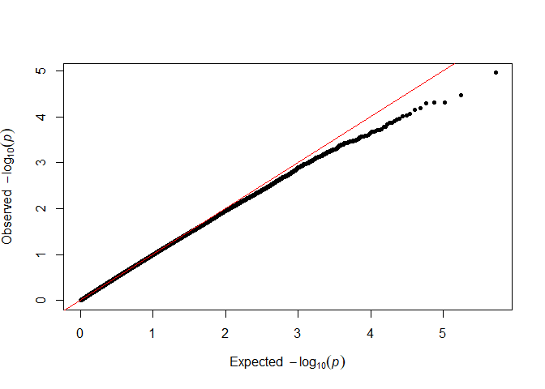

Childhood Acute lymphoblastic leukemia age-specific association
===============================================================

Introduction
------------

Figure 1: Age-specific incidence rate in childhood ALL

Method
------

-   Results were obtained using PLINK

<table>
<caption>Table 1: Final Result.</caption>
<thead>
<tr class="header">
<th style="text-align: left;">SNP</th>
<th style="text-align: center;">CHR</th>
<th style="text-align: center;">BP</th>
<th style="text-align: right;">P</th>
</tr>
</thead>
<tbody>
<tr class="odd">
<td style="text-align: left;">rs10505918</td>
<td style="text-align: center;">12</td>
<td style="text-align: center;">24105874</td>
<td style="text-align: right;">1.10e-05</td>
</tr>
<tr class="even">
<td style="text-align: left;">rs11997355</td>
<td style="text-align: center;">8</td>
<td style="text-align: center;">77492915</td>
<td style="text-align: right;">3.43e-05</td>
</tr>
<tr class="odd">
<td style="text-align: left;">rs7320982</td>
<td style="text-align: center;">13</td>
<td style="text-align: center;">92019926</td>
<td style="text-align: right;">4.87e-05</td>
</tr>
<tr class="even">
<td style="text-align: left;">rs2388773</td>
<td style="text-align: center;">16</td>
<td style="text-align: center;">54636780</td>
<td style="text-align: right;">4.90e-05</td>
</tr>
<tr class="odd">
<td style="text-align: left;">rs665159</td>
<td style="text-align: center;">1</td>
<td style="text-align: center;">239962002</td>
<td style="text-align: right;">4.98e-05</td>
</tr>
</tbody>
</table>

Figure 3: QQ plot

    knitr::include_graphics("Circular-Manhattan.P.jpg")

Figure 4: Circular Manhattan plot

<table style="width:100%;">
<caption>Top one hundred SNPs associated with childhood ALL risk with age-specificity.</caption>
<colgroup>
<col style="width: 7%" />
<col style="width: 6%" />
<col style="width: 7%" />
<col style="width: 2%" />
<col style="width: 2%" />
<col style="width: 2%" />
<col style="width: 8%" />
<col style="width: 13%" />
<col style="width: 13%" />
<col style="width: 13%" />
<col style="width: 8%" />
<col style="width: 14%" />
</colgroup>
<thead>
<tr class="header">
<th style="text-align: left;">SNP</th>
<th style="text-align: center;">Region</th>
<th style="text-align: center;">BP</th>
<th style="text-align: right;">Chr</th>
<th style="text-align: right;">A1</th>
<th style="text-align: left;">A2</th>
<th style="text-align: center;">Location</th>
<th style="text-align: center;">Age_1_5_years_MAF</th>
<th style="text-align: right;">Age_6_10_years_MAF</th>
<th style="text-align: right;">ORint</th>
<th style="text-align: left;">P_value</th>
<th style="text-align: center;">P_value_permutation</th>
</tr>
</thead>
<tbody>
<tr class="odd">
<td style="text-align: left;">rs10505918</td>
<td style="text-align: center;">SOX5</td>
<td style="text-align: center;">24105874</td>
<td style="text-align: right;">12</td>
<td style="text-align: right;">C</td>
<td style="text-align: left;">A</td>
<td style="text-align: center;">intron</td>
<td style="text-align: center;">0.43</td>
<td style="text-align: right;">0.19</td>
<td style="text-align: right;">3.14 (1.88 - 5.22)</td>
<td style="text-align: left;">1.10 x 10-5</td>
<td style="text-align: center;">1.00 x 10-4</td>
</tr>
<tr class="even">
<td style="text-align: left;">rs11997355</td>
<td style="text-align: center;">8q21.11</td>
<td style="text-align: center;">77492915</td>
<td style="text-align: right;">8</td>
<td style="text-align: right;">C</td>
<td style="text-align: left;">T</td>
<td style="text-align: center;">intergenic</td>
<td style="text-align: center;">0.05</td>
<td style="text-align: right;">0.19</td>
<td style="text-align: right;">0.22 (0.11 - 0.45)</td>
<td style="text-align: left;">3.43 x 10-5</td>
<td style="text-align: center;">1.00 x 10-4</td>
</tr>
<tr class="odd">
<td style="text-align: left;">rs7320982</td>
<td style="text-align: center;">13q31.3</td>
<td style="text-align: center;">92019926</td>
<td style="text-align: right;">13</td>
<td style="text-align: right;">C</td>
<td style="text-align: left;">T</td>
<td style="text-align: center;">intergenic</td>
<td style="text-align: center;">0.18</td>
<td style="text-align: right;">0.38</td>
<td style="text-align: right;">0.37 (0.23 - 0.59)</td>
<td style="text-align: left;">4.87 x 10-5</td>
<td style="text-align: center;">2.00 x 10-4</td>
</tr>
<tr class="even">
<td style="text-align: left;">rs2388773</td>
<td style="text-align: center;">16q12.2</td>
<td style="text-align: center;">54636780</td>
<td style="text-align: right;">16</td>
<td style="text-align: right;">A</td>
<td style="text-align: left;">C</td>
<td style="text-align: center;">intergenic</td>
<td style="text-align: center;">0.15</td>
<td style="text-align: right;">0.33</td>
<td style="text-align: right;">0.35 (0.21 - 0.58)</td>
<td style="text-align: left;">4.90 x 10-5</td>
<td style="text-align: center;">1.00 x 10-4</td>
</tr>
<tr class="odd">
<td style="text-align: left;">rs665159</td>
<td style="text-align: center;">CHRM3</td>
<td style="text-align: center;">239962002</td>
<td style="text-align: right;">1</td>
<td style="text-align: right;">T</td>
<td style="text-align: left;">C</td>
<td style="text-align: center;">intron</td>
<td style="text-align: center;">0.55</td>
<td style="text-align: right;">0.33</td>
<td style="text-align: right;">2.53 (1.62 - 3.97)</td>
<td style="text-align: left;">4.98 x 10-5</td>
<td style="text-align: center;">1.00 x 10-4</td>
</tr>
</tbody>
</table>

-   Creating a text file to keep 100 SNPs

<!-- -->

    Age_P_100 <- Age_P %>% 
      select(SNP)

    # write.table(Age_P_100, file="Top_100_P_value.txt",
    #             sep = "/t",
    #             quote = FALSE,
    #             col.names = FALSE,
    #             row.names = FALSE)

-   Hence we had a total of 100 SNPs
-   Next we downloaded SNPs in LD with GWAS SNPs using LDlink
-   Downloaded files were merged and cleaned using r2 &gt;=0.8
-   Duplicated SNPs were removed from further analysis
-   Final file containing all SNPs are AGE\_ALL\_LDlink.txt

<table>
<caption>Age-specific SNPs and SNPs in LD.</caption>
<thead>
<tr class="header">
<th style="text-align: left;">Main_SNP</th>
<th style="text-align: center;">LD_SNP</th>
</tr>
</thead>
<tbody>
<tr class="odd">
<td style="text-align: left;">rs1004327</td>
<td style="text-align: center;">rs1004327</td>
</tr>
<tr class="even">
<td style="text-align: left;">rs1004327</td>
<td style="text-align: center;">rs12508358</td>
</tr>
<tr class="odd">
<td style="text-align: left;">rs1004327</td>
<td style="text-align: center;">rs7674986</td>
</tr>
<tr class="even">
<td style="text-align: left;">rs1004327</td>
<td style="text-align: center;">rs6838381</td>
</tr>
<tr class="odd">
<td style="text-align: left;">rs1004327</td>
<td style="text-align: center;">rs2868942</td>
</tr>
</tbody>
</table>

-   A total of 3099 SNPs were obtained from LDlink

-   SNP (rs202050948) identifed in AGE association was not available in
    LDlink, hence SNPs located in LD for this SNP was obtained from
    Haploreg. This SNP is not in LD with any other SNP

### File creation for SNPnexus using LDSNP information

    ##    dbSNP     LD_SNP
    ## 1: dbSNP  rs1004327
    ## 2: dbSNP rs12508358

### File preparation for ANNOVAR using LD\_SNP information

-   Creating only SNP column to

<!-- -->

    ##        LD_SNP
    ## 1:  rs1004327
    ## 2: rs12508358
