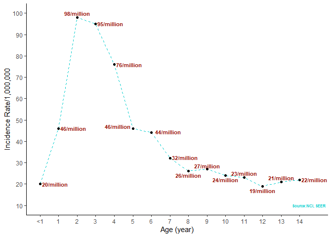

Childhood Acute lymphoblastic leukemia age-specific association
===============================================================

Introduction
------------

    ggplot(Age_incidence, aes(x = Age, y = Incidence_rate))+
      geom_line(linetype = "dashed", color="blue")+
      geom_point()+
      xlab("Age (year)")+
      ylab("Incidence Rate/1,000,000")+
      theme_classic()

Figure 1: Age-specific incidence rate in childhood ALL

